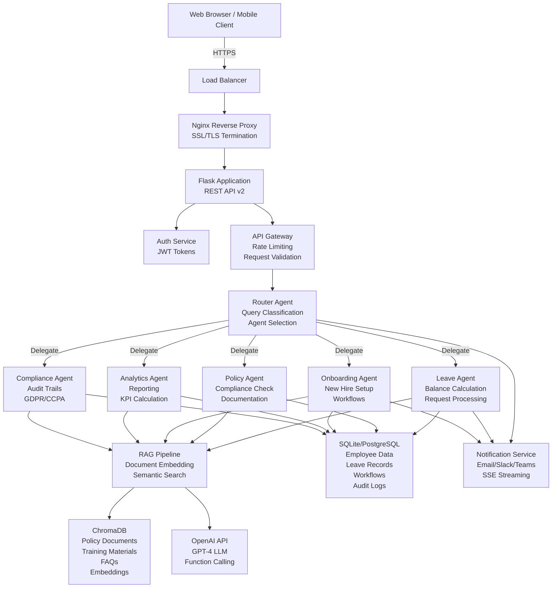
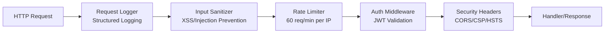
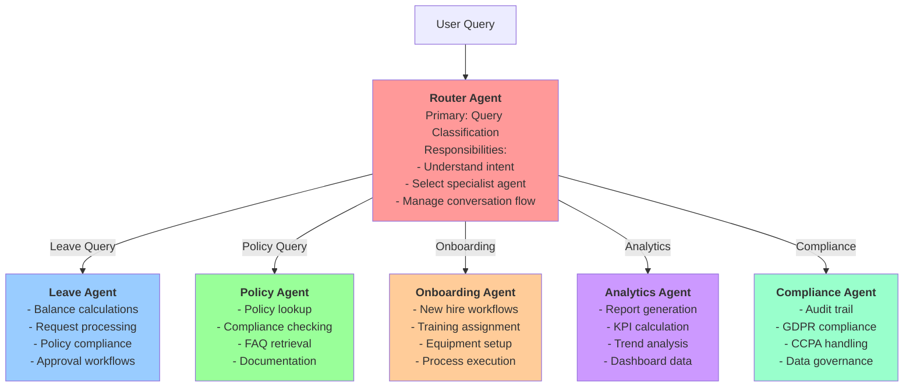
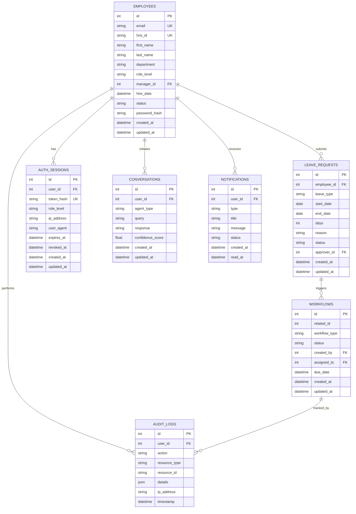
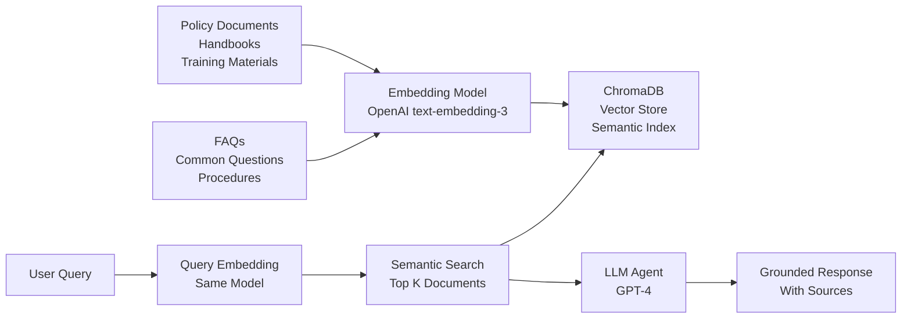

# Architecture Overview - HR Multi-Agent Intelligence Platform

## System Overview

The HR Multi-Agent Intelligence Platform is a sophisticated, production-ready system combining Flask REST APIs with a multi-agent AI system, retrieval-augmented generation (RAG), and enterprise-grade data management.

**Core Technology Stack:**
- **Backend Framework:** Flask (Python 3.10+)
- **AI/LLM:** OpenAI GPT-4 with function calling
- **Vector Database:** ChromaDB for RAG embeddings
- **Relational Database:** SQLite (dev) / PostgreSQL (production)
- **Message Queue:** Redis (optional, for task queues)
- **Frontend:** React.js with TypeScript
- **Deployment:** Docker/Docker Compose, Kubernetes-ready

---

## High-Level Architecture Diagram



---

## Component Architecture

### 1. Frontend Layer
- **React.js SPA** with role-based UI components
- **TypeScript** for type safety
- **Real-time Updates** via Server-Sent Events (SSE)
- **Responsive Design** for desktop and mobile

### 2. API Layer (REST)
**Location:** `/src/api/`

- **Authentication Routes** (`/api/v2/auth/*`)
  - Login, register, token refresh
  - Session management

- **Profile Routes** (`/api/v2/profile`)
  - User profile management
  - Settings and preferences

- **Employee Routes** (`/api/v2/employees`)
  - Directory listing
  - Employee information updates
  - Manager relationships

- **Leave Routes** (`/api/v2/leave/*`)
  - Balance calculations
  - Request submission
  - History tracking

- **Workflow Routes** (`/api/v2/workflows/*`)
  - Pending task retrieval
  - Approval/rejection workflows
  - Status tracking

- **Document Routes** (`/api/v2/documents/*`)
  - Template management
  - Document generation
  - Version control

- **Metrics Routes** (`/api/v2/metrics`)
  - KPI retrieval
  - Dashboard data
  - CSV exports

- **Notification Routes** (`/api/v2/notifications`)
  - Notification retrieval
  - SSE streaming
  - Preferences management

- **Query Routes** (`/api/v2/query`)
  - AI agent query submission
  - Conversation management

### 3. Middleware Stack



**Middleware Components:**

1. **Request Logger** (`middleware/request_logger.py`)
   - Structured logging with JSON output
   - Request/response tracking
   - Performance metrics

2. **Sanitizer** (`middleware/sanitizer.py`)
   - Input validation and sanitization
   - XSS prevention
   - SQL injection prevention

3. **Rate Limiter** (`middleware/rate_limiter.py`)
   - Per-IP rate limiting
   - Per-user rate limiting
   - Configurable thresholds

4. **Authentication** (`middleware/auth.py`)
   - JWT token validation
   - Permission checking
   - Role-based access control

5. **Security Headers** (`middleware/security_headers.py`)
   - CORS policy enforcement
   - CSP (Content Security Policy)
   - HSTS (HTTP Strict Transport Security)
   - X-Frame-Options

---

## Agent Architecture



### Agent Responsibilities

#### Router Agent
Primary orchestrator that:
- Analyzes incoming queries
- Classifies intent and context
- Selects appropriate specialist agent(s)
- Manages multi-turn conversations
- Handles escalations
- Synthesizes responses from multiple agents

#### Leave Agent
Manages all leave-related operations:
- Calculates leave balances (annual, sick, personal)
- Processes leave requests
- Checks policy compliance
- Updates leave records
- Triggers approval workflows
- Sends notifications

#### Policy Agent
Provides policy and compliance information:
- Retrieves company policies
- Answers HR policy questions
- Checks employee eligibility
- References documentation
- Escalates ambiguous cases

#### Onboarding Agent
Manages new employee workflows:
- Creates onboarding tasks
- Assigns training materials
- Schedules meetings
- Equipment provisioning
- System access setup
- Buddy assignment

#### Analytics Agent
Generates insights and reports:
- Calculates HR KPIs
- Creates trend reports
- Generates dashboards
- Exports data
- Identifies patterns
- Predicts metrics

#### Compliance Agent
Ensures regulatory compliance:
- Maintains audit logs
- Tracks GDPR requests
- Handles CCPA data requests
- Manages data retention
- Records policy changes
- Generates compliance reports

---

## Database Schema



### Key Tables

**employees** - Core employee data with HRIS integration
**auth_sessions** - JWT session tracking for security
**leave_requests** - Leave request history and status
**leave_balances** - Current leave balance per employee
**workflows** - Approval workflows and tasks
**audit_logs** - Complete audit trail of all actions
**conversations** - AI agent interaction history
**notifications** - User notifications and alerts
**documents** - Generated documents with versioning
**policies** - HR policy documents and versions

---

## RAG Pipeline



### RAG Components

1. **Document Ingestion**
   - Policy documents converted to markdown
   - Training materials processed
   - FAQs indexed
   - Updates handled via version control

2. **Embedding Generation**
   - Using OpenAI text-embedding-3-small
   - Chunks: 800 tokens with 200-token overlap
   - Stored in ChromaDB

3. **Retrieval**
   - Semantic search with cosine similarity
   - Top-5 documents retrieved
   - Relevance scoring

4. **Generation**
   - GPT-4 with function calling
   - Context injected from retrieved documents
   - Source attribution included

---

## Server-Sent Events (SSE) Flow

```mermaid
sequence
    participant Client as Web Browser
    participant Server as Flask Server
    participant NotifService as Notification Service
    participant Events as Event Bus
    
    Client->>Server: GET /api/v2/notifications/stream
    Server->>Client: 200 OK (Content-Type: text/event-stream)
    
    Events->>NotifService: leave_request_created
    NotifService->>Server: emit_notification(user_id, data)
    Server->>Client: data: {"type": "workflow_pending", ...}
    
    Events->>NotifService: workflow_approved
    NotifService->>Server: emit_notification(user_id, data)
    Server->>Client: data: {"type": "workflow_approved", ...}
    
    Client->>Client: Heartbeat check (30s)
    alt Connection Lost
        Client->>Server: Reconnect
        Server->>Client: Resume stream
    end
```

---

## Directory Structure

```
/sessions/determined-brave-darwin/mnt/HR_agent/
├── src/                              # Source code
│   ├── app.py                        # Main Flask app
│   ├── app_v2.py                    # Flask app v2 with all routes
│   ├── agents/                      # Multi-agent system
│   │   ├── router_agent.py         # Primary orchestrator
│   │   ├── leave_agent.py          # Leave management
│   │   ├── policy_agent.py         # Policy queries
│   │   ├── onboarding_agent.py     # Onboarding workflows
│   │   ├── analytics_agent.py      # Analytics & reporting
│   │   ├── performance_agent.py    # Performance management
│   │   ├── benefits_agent.py       # Benefits inquiries
│   │   ├── base_agent.py           # Base agent class
│   │   ├── handoff_protocol.py     # Agent-to-agent handoff
│   │   └── e2e_scenarios.py        # End-to-end test scenarios
│   │
│   ├── api/                         # REST API routes
│   │   ├── admin_routes.py         # Admin operations
│   │   ├── export_routes.py        # Data exports
│   │   ├── health_routes.py        # Health checks
│   │   ├── routes/
│   │   │   └── agent_routes.py     # Agent query endpoints
│   │   └── v2/                     # API v2 endpoints
│   │
│   ├── core/                        # Core services
│   │   ├── database.py             # SQLAlchemy models
│   │   ├── cache.py                # Caching service
│   │   ├── conversation_memory.py  # Conversation state
│   │   ├── document_generator.py   # Document generation
│   │   ├── document_versioning.py  # Version control
│   │   ├── bias_audit.py           # Bias detection
│   │   ├── ccpa.py                 # CCPA compliance
│   │   ├── gdpr_repository.py      # GDPR tools
│   │   ├── feature_flags.py        # Feature management
│   │   ├── backup_restore.py       # Data backup
│   │   ├── alerting.py             # Alert service
│   │   ├── rag_system.py           # RAG pipeline
│   │   └── ...                      # Other services
│   │
│   ├── middleware/                  # Request middleware
│   │   ├── request_logger.py       # Structured logging
│   │   ├── sanitizer.py            # Input sanitization
│   │   ├── auth.py                 # Authentication
│   │   ├── rate_limiter.py         # Rate limiting
│   │   ├── security_headers.py     # Security headers
│   │   └── ...                      # Other middleware
│   │
│   ├── repositories/                # Data access layer
│   │   ├── base_repository.py      # Base class
│   │   ├── document_repository.py  # Document queries
│   │   ├── workflow_repository.py  # Workflow queries
│   │   ├── notification_repository.py  # Notifications
│   │   ├── dashboard_repository.py # Dashboard metrics
│   │   └── ...                      # Other repositories
│   │
│   ├── services/                    # Business logic
│   │   ├── leave_service.py        # Leave calculations
│   │   ├── workflow_service.py     # Workflow processing
│   │   └── ...                      # Other services
│   │
│   ├── platform_services/           # Platform features
│   │   ├── notification_service.py # Notification handling
│   │   ├── email_service.py        # Email delivery
│   │   ├── slack_bot.py            # Slack integration
│   │   ├── teams_bot.py            # Teams integration
│   │   └── ...                      # Other integrations
│   │
│   └── connectors/                  # External integrations
│       ├── hris_interface.py       # HRIS system API
│       ├── slack_connector.py      # Slack API
│       ├── teams_connector.py      # Microsoft Teams API
│       └── ...                      # Other connectors
│
├── frontend/                        # React.js frontend
│   ├── src/
│   │   ├── components/             # React components
│   │   ├── pages/                  # Page components
│   │   ├── hooks/                  # Custom React hooks
│   │   ├── services/               # API clients
│   │   └── App.tsx                 # Main app component
│   ├── public/
│   ├── static/
│   ├── templates/                  # HTML templates
│   └── package.json
│
├── config/                          # Configuration files
│   ├── settings.py                 # Base settings
│   ├── settings_dev.py             # Development
│   ├── settings_prod.py            # Production
│   └── settings_test.py            # Testing
│
├── migrations/                      # Database migrations
│   ├── env.py
│   ├── script.py.mako
│   └── versions/
│       └── 2026_02_14_001_initial_schema.py
│
├── tests/                           # Test suite
│   ├── unit/                       # Unit tests
│   ├── integration/                # Integration tests
│   └── e2e/                        # End-to-end tests
│
├── scripts/                         # Utility scripts
│   ├── seed_database.py            # Initialize DB
│   ├── export_data.py              # Data export
│   └── ...                          # Other utilities
│
├── docs/                           # Documentation
│   ├── API_REFERENCE.md           # API docs
│   ├── ARCHITECTURE.md            # This file
│   ├── DEVELOPER_GUIDE.md         # Developer setup
│   └── USER_GUIDE.md              # User guide
│
├── docker-compose.yml             # Local development
├── Dockerfile                     # Container image
├── requirements.txt               # Python dependencies
├── package.json                   # Node dependencies
├── alembic.ini                   # Migration config
└── run.py                         # Entry point
```

---

## Deployment Architecture

### Development Environment
```
Docker Compose:
- Flask app (port 5000)
- PostgreSQL (port 5432)
- ChromaDB (port 8000)
- Redis (port 6379)
- Nginx (port 80/443)
```

### Production Environment
```
Kubernetes:
- Flask app deployment (replicas: 3)
- PostgreSQL StatefulSet
- ChromaDB StatefulSet
- Redis for caching
- Nginx Ingress Controller
- Prometheus for metrics
- ELK for logging
- CloudFlare for CDN
```

---

## Security Architecture

### Authentication & Authorization
1. **JWT Tokens** - Stateless, signed with HS256
2. **Token Expiration** - 1 hour default, refresh tokens for extensions
3. **Role-Based Access Control (RBAC)**
   - employee
   - manager
   - hr_generalist
   - hr_admin
   - system_admin

### Data Security
- **Encryption at Rest** - AES-256 for sensitive data
- **Encryption in Transit** - TLS 1.2+ mandatory
- **Password Hashing** - bcrypt with salt
- **PII Protection** - Masked in logs, tokenized in audit trails

### Compliance
- **GDPR** - Data retention, erasure, portability
- **CCPA** - Data disclosure, deletion, opt-out
- **SOC 2** - Access controls, change management
- **ISO 27001** - Information security management

---

## Performance Optimization

1. **Caching Strategy**
   - Redis for session cache (1 hour TTL)
   - Database query cache (5 minute TTL)
   - Vector embedding cache (persistent)

2. **Database Optimization**
   - Connection pooling (10 connections)
   - Query optimization with indexes
   - Slow query logging

3. **API Response Optimization**
   - Response compression (gzip)
   - Pagination for large datasets
   - Field filtering support

4. **Async Processing**
   - Celery for background tasks
   - Document generation jobs
   - Email sending
   - Data exports

---

## Monitoring & Observability

### Metrics
- Request latency (p50, p95, p99)
- Error rate by endpoint
- Agent response time
- Database connection pool status
- Cache hit rate

### Logging
- Structured JSON logging
- Centralized log aggregation (ELK)
- Request/response tracking
- Agent decision logging

### Tracing
- Distributed tracing with correlation IDs
- Agent-to-agent handoff tracking
- Database query tracing
- External API call tracing

---

## Disaster Recovery

1. **Backup Strategy**
   - Daily database backups (incremental)
   - Point-in-time recovery capability
   - Vector database replication

2. **Failover**
   - Multi-region deployment
   - Automatic failover in 1 minute
   - Database replication

3. **Recovery Time Objective (RTO)** - 15 minutes
4. **Recovery Point Objective (RPO)** - 1 hour

